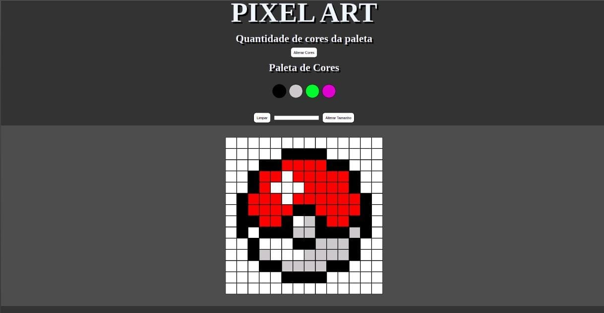

# Pixel Art

### (Constantly changing project)

---

---

## About project

[Project's Page](https://murilo-rainho.github.io/Pixel-Art/)

This project was made during my first week in the second month on the Trybe Course. Me, without knowledge before the course, **with two month of course**, was able to use some basic knowledge about HTML, CSS and JavaScript.

---

### what is the site for?

...

### HTML

...

---

### CSS

...

### JavaScript

...

---
